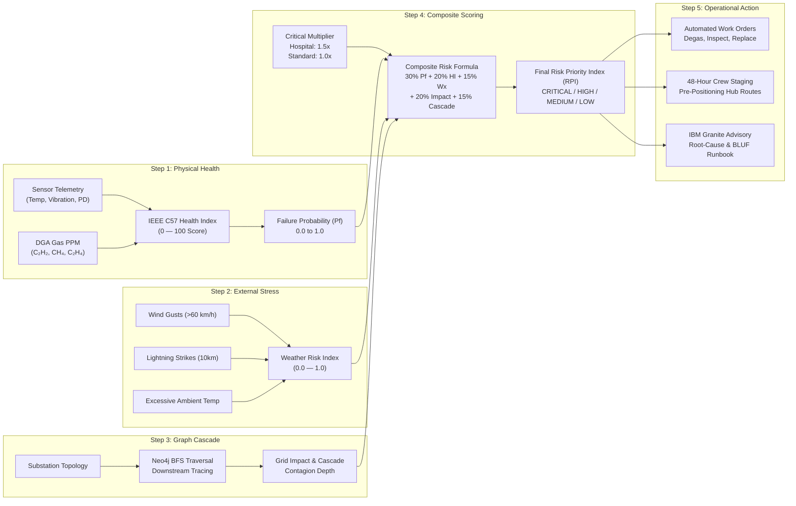
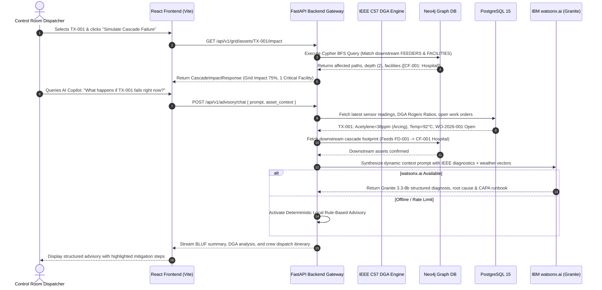

# GridPulse AI — Enterprise Architecture Specification

## Executive Summary

**GridPulse AI** is a mission-critical, full-stack predictive maintenance and power outage mitigation platform engineered for electric transmission and distribution (T&D) utilities. The platform continuously ingests high-frequency substation telemetry, calculates **IEEE C57-compliant** asset health indices, integrates real-time meteorological stress vectors, executes graph-based cascade failure simulations via **Neo4j**, and synthesizes natural-language operational briefs and crew staging orders powered by **IBM watsonx.ai** and **IBM Granite**.

---

## 1. End-to-End System Architecture

```mermaid
flowchart TD
    %% Styling Classes
    classDef client fill:#1e293b,stroke:#38bdf8,stroke-width:2px,color:#f8fafc;
    classDef gateway fill:#0f172a,stroke:#60a5fa,stroke-width:2px,color:#f8fafc;
    classDef compute fill:#1e1b4b,stroke:#818cf8,stroke-width:2px,color:#f8fafc;
    classDef storage fill:#022c22,stroke:#34d399,stroke-width:2px,color:#f8fafc;
    classDef ai fill:#450a0a,stroke:#f87171,stroke-width:2px,color:#f8fafc;
    classDef external fill:#2e1065,stroke:#c084fc,stroke-width:2px,color:#f8fafc;

    %% Data Sources
    subgraph INGESTION["1. TELEMETRY & INGESTION TIER"]
        Sensors["📡 Substation SCADA<br/>• Top-Oil & Winding Temp<br/>• Mechanical Tank Vibration<br/>• Partial Discharge (PD)"]:::external
        DGAStream["🧪 Dissolved Gas Analysis<br/>• H₂, CH₄, C₂H₂, C₂H₄, C₂H₆<br/>• CO, CO₂ PPM Readings"]:::external
        Meteo["🌩️ Meteorological Radar<br/>• Wind Gusts & Sustained Winds<br/>• Lightning 10km Proximity<br/>• Ambient Heat & Precipitation"]:::external
    end

    %% Presentation Layer
    subgraph PRESENTATION["2. PRESENTATION & OPERATOR CONTROL ROOM (React 18 + Vite)"]
        UI_Dash["📊 Executive Dashboard<br/>Risk Distribution & Critical Alerts"]:::client
        UI_Grid["🗺️ Grid Single-Line Schematic<br/>4-Tier Hierarchy & GIS Collision Repulsion"]:::client
        UI_Risk["📈 Asset Risk Matrix<br/>IEEE C57 Health vs Weather Stress"]:::client
        UI_Crew["🚚 48-Hour Crew Staging<br/>Hub Pre-Positioning & Work Orders"]:::client
        UI_AI["💬 AI Incident Copilot<br/>Granite Explainable Root-Cause Chat"]:::client
    end

    %% API Gateway & Backend
    subgraph BACKEND["3. BACKEND SERVICES (FastAPI Microservice Engine)"]
        API_GW["⚡ FastAPI Application Gateway (Uvicorn / ASGI)<br/>CORS • OpenAPI 3.1 • Lifespan Lifecycle"]:::gateway

        subgraph ENGINES["Core Computation Engines"]
            DGA_Eng["🔬 IEEE C57 DGA Engine<br/>• Rogers Ratios Classifier<br/>• Duval Triangle Fault Mapping<br/>• Asset Health Index (HI 0-100)"]:::compute
            Risk_Eng["⚖️ Multi-Factor Risk Correlator<br/>• Failure Probability (Pf)<br/>• Weather Stress Multiplier<br/>• Critical Facility Multiplier (1.5x)"]:::compute
            Cascade_Eng["🕸️ BFS Cascade Engine<br/>• Neo4j Graph Traversal<br/>• Downstream Customer Impact<br/>• Hospital/Water Supply Vulnerability"]:::compute
            Crew_Eng["📋 Field Dispatch Engine<br/>• 48-Hour Staging Horizon<br/>• Hub Allocation & Work Orders"]:::compute
        end
    end

    %% Storage Layer
    subgraph PERSISTENCE["4. HYBRID PERSISTENCE TIER (Dockerized)"]
        Postgres[("🐘 PostgreSQL 15<br/>• Substation & Transformer Specs<br/>• Time-Series Telemetry & DGA Logs<br/>• Weather Snapshots & Work Orders<br/>• Historical Incident Archive")]:::storage
        Neo4j[("🔷 Neo4j 5 Graph DB<br/>• (:Substation)-[:CONTAINS]-><br/>• (:Transformer)-[:FEEDS]-><br/>• (:Feeder)-[:SUPPLIES]-><br/>• (:CriticalFacility)")]:::storage
    end

    %% AI / LLM Tier
    subgraph AI_TIER["5. AI ADVISORY & REASONING TIER"]
        Granite["🧠 IBM watsonx.ai — IBM Granite<br/>Granite 3.3-8b / 13B Instruct<br/>• Structured Incident Root-Cause<br/>• BLUF Operator Diagnostics<br/>• Actionable CAPA Procedures"]:::ai
        Fallback["🛡️ Local Rule-Based Advisory<br/>Deterministic Fallback Engine<br/>Zero-Downtime Guarantee"]:::ai
    end

    %% Connections
    Sensors -->|JSON / Telemetry Stream| API_GW
    DGAStream -->|DGA Records| API_GW
    Meteo -->|Forecast Snapshots| API_GW

    PRESENTATION <-->|HTTP / REST (Axios)| API_GW

    API_GW --> DGA_Eng
    API_GW --> Risk_Eng
    API_GW --> Cascade_Eng
    API_GW --> Crew_Eng

    DGA_Eng --> Risk_Eng
    Cascade_Eng --> Risk_Eng
    Risk_Eng --> Crew_Eng

    Risk_Eng <-->|SQLAlchemy Async / asyncpg| Postgres
    Crew_Eng <-->|Work Orders CRUD| Postgres
    Cascade_Eng <-->|Cypher Queries / Bolt| Neo4j

    Risk_Eng -->|Context Vector + Topology| Granite
    Risk_Eng -.->|On Offline / Rate Limit| Fallback
    Granite --> API_GW
    Fallback --> API_GW
```

---

## 2. Multi-Factor Risk & Outage Scoring Pipeline



---

## 3. Data Flow & Request Lifecycle



---

## 4. Layer-by-Layer Architectural Decomposition

### 4.1 Presentation Tier (Frontend)
- **Framework**: React 18.2 + TypeScript, powered by Vite 5 for ultra-low latency HMR and tree-shaken production bundles.
- **Styling Architecture**: Custom CSS Design System utilizing scoped HSL CSS tokens, glassmorphic panel translucency (`rgba(15, 23, 42, 0.75)`), and dark-mode optimization for utility control room ergonomics.
- **Visualization Engine**:
  - **Grid Topology Canvas**: Custom-built interactive SVG single-line schematic flow organized into a 4-tier transmission & distribution hierarchy (`SUBSTATIONS` ➔ `TRANSFORMERS` ➔ `FEEDERS` ➔ `CRITICAL LOADS`).
  - **Collision Repulsion**: Force-directed spatial relaxation prevents node overlaps in GIS Geographic mode.
  - **Chart Engine**: Chart.js 4 for multi-axis telemetry degradation trends and risk distribution matrices.

### 4.2 Application Gateway & API Tier (Backend)
- **Framework**: FastAPI (Python 3.11) with high-concurrency async ASGI execution under Uvicorn.
- **Data Validation**: Strict Pydantic v2 schema enforcement across all ingress and egress payloads.
- **Modular Routers**:
  - `health`: Multi-dependency liveness and readiness probe (PostgreSQL, Neo4j, watsonx connectivity).
  - `assets`: Full asset registry, sensor time-series, and DGA sample lookups.
  - `risk`: Composite risk scoring rankings, failure probability, and weather vulnerability matrices.
  - `grid`: Full Neo4j topology graph queries, cascade simulation, and failure propagation analysis.
  - `weather`: Meteorological vector ingestion and 48-hour field crew pre-positioning itineraries.
  - `advisory`: Asset-specific diagnostics and dynamic context-aware conversational AI chat.
  - `recommendations`: Work order lifecycle management (`GET`, `POST`, `PATCH`).
  - `dashboard`: High-performance aggregated metrics caching layer.

### 4.3 Intelligence & Analytics Core
- **IEEE C57.104 DGA Analyzer**:
  - Computes gas ratios: $CH_4 / H_2$, $C_2H_2 / C_2H_4$, $C_2H_4 / C_2H_6$, and $CO_2 / CO$.
  - Classifies dielectric failure modes: Normal aging, Low-energy partial discharge (corona), High-energy arcing ($C_2H_2 \uparrow$), and Thermal overheating ($>700^\circ C$).
- **Graph Cascade Analyzer**:
  - Cypher BFS algorithms trace dependency chains from substation transformers to distribution feeders and critical civic nodes (hospitals, water treatment facilities, emergency networks).
- **Multi-Factor Risk Fusion**:
  $$\text{Base Risk} = 0.30 \cdot P_f + 0.20 \cdot \text{HI}_{\text{risk}} + 0.15 \cdot W_{\text{risk}} + 0.20 \cdot \text{Grid}_{\text{impact}} + 0.15 \cdot \text{Cascade}_{\text{risk}}$$
  $$\text{Final Risk} = \min\left(1.0, \text{Base Risk} \times \text{Critical Multiplier}\right)$$

### 4.4 Hybrid Persistence Tier
- **Relational Storage (PostgreSQL 15)**:
  - Stores relational asset metadata, granular high-frequency telemetry, DGA laboratory assays, weather snapshots, and operational work orders.
  - Managed via SQLAlchemy 2.0 Async Session engine with Alembic migration versioning.
- **Graph Storage (Neo4j 5 Community)**:
  - Models physical transmission and distribution network topology.
  - Node Labels: `:Substation`, `:Transformer`, `:Feeder`, `:CriticalFacility`.
  - Relationship Types: `[:CONTAINS]`, `[:FEEDS]`, `[:SUPPLIES]`, `[:CONNECTS_TO]`.

### 4.5 AI Advisory Tier (IBM watsonx.ai + Granite)
- **Model**: IBM Granite (`ibm/granite-13b-instruct-v2` or `ibm/granite-3.3-8b-instruct`).
- **Prompt Engineering**: Dynamic multi-modal telemetry injection combining equipment nameplate ratings, IEEE DGA classifications, real-time weather alerts, and downstream cascade risks.
- **Zero-Downtime Fallback**: Built-in deterministic rule-based expert engine ensures that even during cloud network interruptions or quota limits, operators receive instant, reliable diagnostic runbooks.

---

## 5. Technology Stack Summary

| Dimension | Technology | Specification / Role |
|---|---|---|
| **Frontend Framework** | React 18.2 | Component-driven declarative UI with TypeScript strict mode |
| **Build Tooling** | Vite 5 | Fast production bundling and optimized asset chunking |
| **Styling & Design** | Vanilla CSS3 | Control-room glassmorphic theme, responsive flexbox/grid |
| **Backend Framework** | FastAPI 0.110+ | Asynchronous REST API service with auto-generated OpenAPI docs |
| **ASGI Server** | Uvicorn | High-throughput asynchronous worker execution |
| **Relational Database** | PostgreSQL 15 | Time-series telemetry, DGA assays, work orders, incidents |
| **Graph Database** | Neo4j 5 | Grid network single-line topology & cascade failure modeling |
| **ORM / Query Engine** | SQLAlchemy 2.0 (asyncpg) | Non-blocking database session management |
| **AI / Foundation Model** | IBM watsonx.ai | IBM Granite 3.3-8b / 13B Instruct for root-cause synthesis |
| **Testing Framework** | Pytest 8 + pytest-asyncio | 147 unit, integration, and end-to-end regression tests |
| **Containerization** | Docker + Docker Compose | Multi-container orchestrated microservices stack |

---

## 6. Complete API Surface

| HTTP Method | Resource Path | Primary Function |
|---|---|---|
| `GET` | `/api/v1/health` | Comprehensive health check and dependency status (DB, Neo4j, watsonx) |
| `GET` | `/api/v1/dashboard` | Executive KPI summary (fleet risk, critical count, weather alerts) |
| `GET` | `/api/v1/assets` | Monitored asset fleet registry with computed health and risk ranks |
| `GET` | `/api/v1/assets/{id}` | Comprehensive asset dossier with time-series sensors and DGA history |
| `GET` | `/api/v1/risk` | Fleet risk ranking sorted by Risk Priority Index (RPI) |
| `GET` | `/api/v1/grid/topology` | Full single-line graph topology for visual schematic and GIS mapping |
| `GET` | `/api/v1/grid/assets/{id}/impact` | Graph BFS cascade propagation failure simulation |
| `GET` | `/api/v1/weather` | Localized meteorological risk scores and active weather alerts |
| `GET` | `/api/v1/weather/crew-preposition` | 48-Hour tactical field crew staging and hub pre-positioning plan |
| `POST` | `/api/v1/advisory` | Asset-specific AI diagnosis with IEEE DGA breakdown and CAPA |
| `POST` | `/api/v1/advisory/chat` | Free-form natural language copilot with dynamic contextual retrieval |
| `GET` | `/api/v1/recommendations` | Automated work order recommendations generated from telemetry |
| `GET` | `/api/v1/workorders` | Active and historical maintenance work orders |
| `POST` | `/api/v1/workorders` | Create a new maintenance or inspection work order |
| `PATCH` | `/api/v1/workorders/{id}` | Update work order status (`open`, `in_progress`, `completed`, `cancelled`) |

---

## 7. Security, Resilience & Operational Isolation

1. **Zero Secret Leakage**:
   - All credentials (`WATSONX_API_KEY`, `POSTGRES_PASSWORD`, `NEO4J_AUTH`) reside strictly in runtime environment variables.
   - Dedicated `.env.example` templates committed without sensitive tokens.
2. **Network Isolation**:
   - Internal microservices communicate over an isolated Docker network (`gridpulse_network`).
   - Only required host ports are exposed (`3000` for frontend, `8000` for API gateway).
3. **Graceful Degradation**:
   - When external AI endpoints are unreachable, the system automatically falls back to deterministic IEEE standard rule sets without throwing 500 errors.
   - Sensor telemetry inputs are clamped and sanitized, preventing division-by-zero or NaN propagation across the risk formula.
