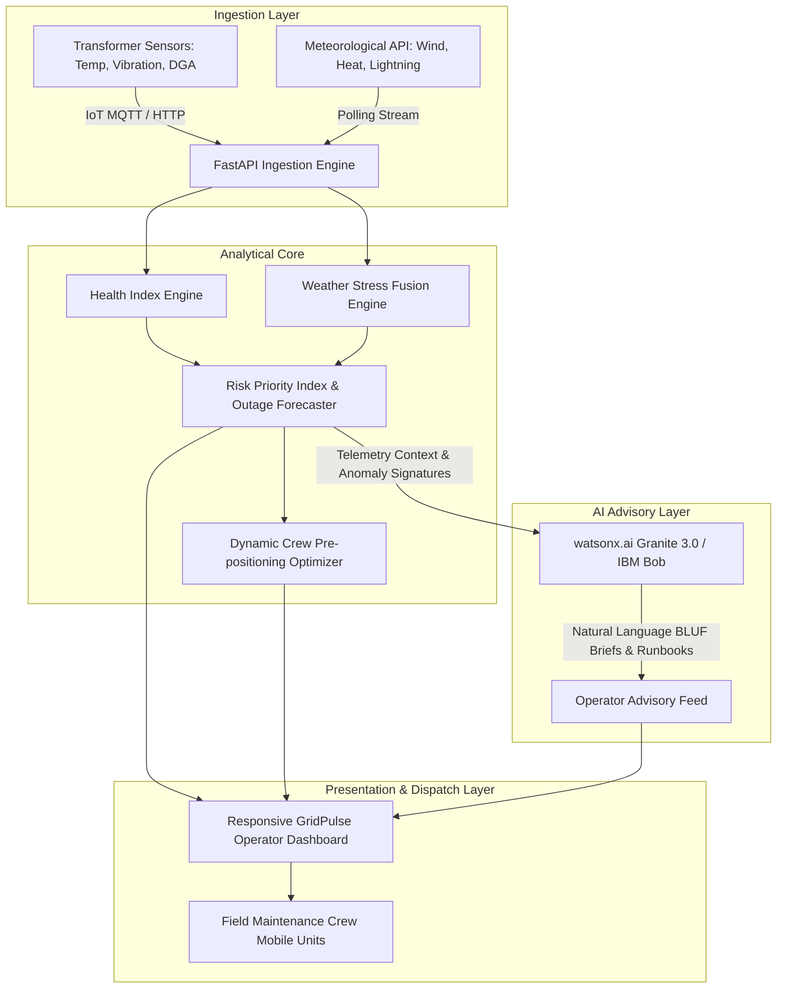

# System Architecture: GridPulse AI

## System Architecture

GridPulse AI connects physical utility infrastructure telemetry, meteorological feeds, predictive analytical algorithms, and enterprise AI models into a unified control room dashboard.

## Components

| Component | Technology | Responsibility |
|---|---|---|
| **API & Risk Core** | FastAPI / Python 3.10+ | Real-time telemetry processing, health index computation, and outage scoring. |
| **Risk Engines** | Custom Mathematical Engine (`src/app/engine.py`) | IEEE C57 compliant DGA gas analysis, vibration metrics, and weather risk compounding. |
| **Dispatcher Dashboard** | HTML5, Modern Glassmorphism CSS, Vanilla JS | Visualization of substation telemetry, outage risk rankings, and emergency crew plans. |
| **AI Copilot** | watsonx.ai Granite Models / IBM Bob | Automated root-cause analysis and natural-language incident mitigation runbooks. |
| **Data & State Layer**| In-memory telemetry cache & JSON state | High-performance state storage for asset monitoring and scenario simulation. |

## Data Flow

1. **Telemetry Streaming**: Substation sensor streams (oil temperature, vibration, partial discharge, dissolved acetylene/ethylene) and weather feeds (wind speed, ambient heat, lightning hits) hit the `/api/v1/substations` endpoint.
2. **Health Indexing**: Internal transformer health is calculated from 0 to 100 based on standard IEEE insulation thresholds.
3. **Compound Stress Assessment**: The weather stress multiplier (0.0 to 1.0) is factored against the asset vulnerability, generating an Outage Failure Probability (`%`).
4. **Criticality Weighting**: The system evaluates downstream grid impact based on transformer MVA capacity and connected critical consumer counts (hospitals, dense residential zones).
5. **Pre-Positioning Generation**: The emergency optimizer generates ranked maintenance actions and assigns mobile repair units to prevent outages before storm touchdown.

## Security Considerations

- **Credential Isolation**: All IBM Cloud and watsonx API credentials are stored in `.env` and loaded via `python-dotenv`, strictly excluded from version control via `.gitignore`.
- **Read-Only Advisory Sandbox**: Control commands generated by the system operate in an advisory capacity, preventing accidental automated switching actions on live grid hardware.
- **Data Sanitization**: Incoming telemetry payloads are strictly validated using Pydantic data schemas to prevent malformed or injection payloads.

## Scalability Notes

- **Stateless Microservice**: The FastAPI application is stateless and containerizable with Docker, capable of horizontal scaling behind an NGINX or Kubernetes ingress controller.
- **Asynchronous Worker Pools**: For enterprise deployments across thousands of substations, sensor streams can be decoupled using Apache Kafka or RabbitMQ pipelines.
